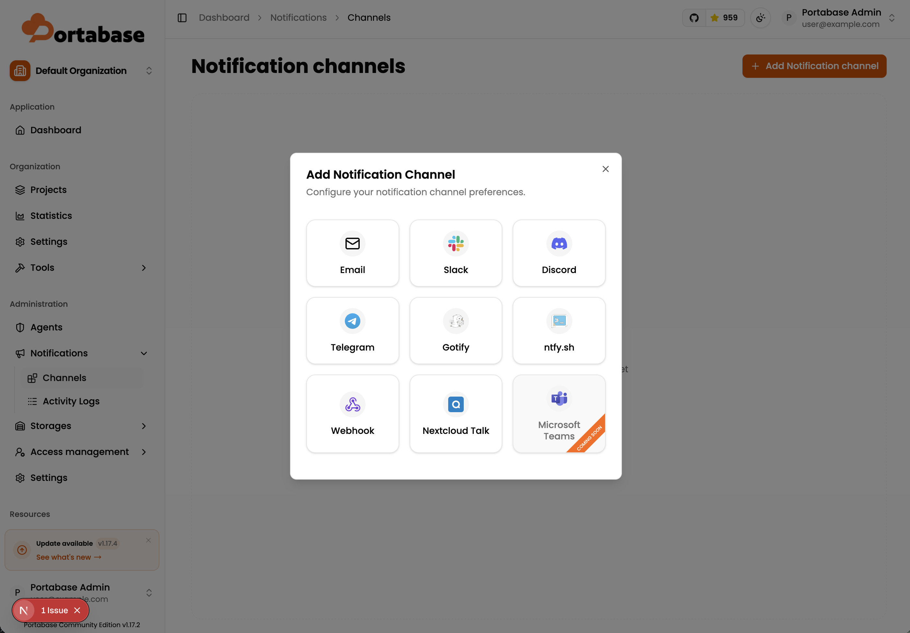

# Contribution 1: Add Microsoft Teams as notification provider

**Contribution Number:** 1  
**Student:** Ignacio De La Cruz  
**Issue:** [Link](https://github.com/Portabase/portabase/issues/260)   
**Status:** Phase I 

---

## Why I Chose This Issue

I am interested in tackling the "Add Microsoft Teams as notification provider" issue because it aligns well with my experience building full-stack applications. Throughout various projects, I have worked with React-based frontends, REST APIs, and backend development. Since this issue involves both implementing backend notification logic and creating frontend configuration components, it closely matches the types of technologies and challenges I have worked with in my coursework and personal projects.

By contributing to this issue, I hope to gain experience working within an established open-source codebase and strengthen my TypeScript skills in a real-world development environment. I am also interested in learning more about extending modular application architectures and integrating third-party services into a production application.

---

## Understanding the Issue

### Problem Description

Portabase uses several third-party providers to send alerts to users. 

### Expected Behavior

Microsoft teams should be added as an option to send alerts to users.

### Current Behavior

Currently Microsoft teams is not an option for sending alerts to users. 

### Affected Components

1. Create Microsoft Teams notification provider
   - Implement sendTeams in:
src/features/notifications/providers/teams.ts

2. Register provider in notification system
   - Add sendTeams to provider handlers: src/features/notifications/providers/index.ts

Extend provider type system by adding teams to ProviderKind:
src/features/notifications/types.ts

3. Implement Teams configuration form (schema + UI)
   - Create validation schema: src/components/wrappers/dashboard/admin/channels/channel/channel-form/providers/notifications/forms/teams.schema.ts

   - Create UI form component: src/components/wrappers/dashboard/admin/channels/channel/channel-form/providers/notifications/forms/teams.form.tsx

4. Integrate Teams into UI provider system
   - Update channel form schema: src/components/wrappers/dashboard/admin/channels/channel/channel-form/channel-form.schema.ts

   - Update provider registry: src/components/wrappers/dashboard/admin/channels/helpers/notification.tsx
Remove preview: true for Teams provider.

   - Update form renderer: Add teams case in renderChannelForm in: src/components/wrappers/dashboard/admin/channels/helpers/common.tsx

---

## Reproduction Process

### Environment Setup

1. Clone the repository
   - git clone https://github.com/Portabase/portabase.git
   - cd portabase

2. Install dependencies
   - install nvm
      - install homebrew
         - /bin/bash -c "$(curl -fsSL https://raw.githubusercontent.com/Homebrew/install/HEAD/install.sh)"
     - install nvm via homebrew: 
        - brew install nvm
     - Create the NVM directory:
        - mkdir ~/.nvm
     - Reload your terminal configuration so the changes take effect:
        - source ~/.zshrc
   - install node via nvm
      - nvm install --lts
      - nvm use --lts
   - pnpm install
      - For macos apple silicon:
         - curl -fsSL https://get.pnpm.io/install.sh | sh -

3. Environment configuration
   - Copy the example environment file and adjust values if necessary:
      - cp .env.example .env

4. Start in development mode
   - make up

The above four steps are the instructions given in the project wiki for contributors. However before starting in development mode you first need to get the database running locally: 
- docker compose up -d db

### Steps to Reproduce

1. Log onto app using credentials from .env
2. On left under Administration, navigate to Notifications > Channels.
3. Click + Add Notification Channel
4. Microsoft Teams button is unclickable

### Reproduction Evidence

- **Commit showing reproduction:** [Link to commit in your fork](https://github.com/Malilav/portabase/pull/new/fix-issue-260)
- **Screenshots/logs:** 
- **My findings:** Microsoft teams option for notification provider is greyed out and labled as coming soon.

---

## Solution Approach

### Analysis

Feature is not yet implemented.

### Proposed Solution

Add Microsoft Teams as notification provider

### Implementation Plan

Using UMPIRE framework (adapted):

**Understand:** 
Portabase currently supports multiple third-party webhook integrations (like Slack, Telegram, and Discord) to alert users about database backup statuses and agent connectivity. However, it currently lacks support for Microsoft Teams.

**Match:** 
I will use the existing slack.ts and discord.ts backend provider files (located in src/features/notifications/providers/) as a structural blueprint for how to format the outbound fetch request and error handling. For the frontend, I will look at the existing Zod schemas and ShadcnUI form components used for Discord/Slack to ensure my new Teams configuration form matches the project's design system and validation standards.

**Plan:** [Step-by-step implementation plan]
1. What is the root cause/context?
   - The codebase utilizes a strictly typed registry system (ProviderKind) and a unified channel form renderer. To add a new provider, it must be injected into multiple specific layers of the application—from the TypeScript definitions up to the React switch statements that render the UI.

2. What is the proposed fix/implementation?
   - I will implement this feature in two main slices:

      - Backend: Define the new teams type, create the sendTeams webhook execution logic, and register it in the main provider handler.

      - Frontend: Write a Zod validation schema for the Teams configuration (requiring a valid Webhook URL string), build the React form UI component, and update the global channel form schema and renderer switch statement to display the new UI.

3. What files will I touch?
I will create two new files and modify five existing files:

   - (New) src/features/notifications/providers/teams.ts

   - (New) src/components/wrappers/dashboard/admin/channels/channel/channel-form/providers/notifications/forms/teams.schema.ts

   - (New) src/components/wrappers/dashboard/admin/channels/channel/channel-form/providers/notifications/forms/teams.form.tsx

   - (Modify) src/features/notifications/providers/index.ts

   - (Modify) src/features/notifications/types.ts

   - (Modify) src/components/wrappers/dashboard/admin/channels/channel/channel-form/channel-form.schema.ts

   - (Modify) src/components/wrappers/dashboard/admin/channels/helpers/notification.tsx

   - (Modify) src/components/wrappers/dashboard/admin/channels/helpers/common.tsx

**Implement:** [Add Microsoft Teams as notification provider](https://github.com/Portabase/portabase/pull/313)

**Review:** 
I will self-review my code against Portabase's CONTRIBUTING.md. Specifically, I will ensure that my new sendTeams function is strictly typed using TypeScript, that the React components utilize the existing UI component library properly without inline styling, and that I have run the project's linter/formatter before committing. I will also verify that preview: true is fully removed from the Teams provider so it registers as an active feature

**Evaluate:** 
1. To test this feature end-to-end, I will:

2. Create a free Microsoft Teams workspace and generate a live Incoming Webhook URL.

3. Spin up the local Portabase Next.js and PostgreSQL development environment.

4. Navigate to the local dashboard and configure a new Microsoft Teams notification channel using my live webhook URL.

5. Trigger a test notification from the Portabase system and verify that the payload successfully appears in my external Microsoft Teams desktop client.

6. Capture the mandatory validation screenshots (Add dialog, Create mode, Edit mode) to append to my Pull Request.

---

## Testing Strategy

### Unit Tests

- [ ] Test case 1: [Description]
- [ ] Test case 2: [Description]
- [ ] Test case 3: [Description]

### Integration Tests

- [ ] Integration scenario 1
- [ ] Integration scenario 2

### Manual Testing

1. Created a free Microsoft Teams workspace and generate a live Incoming Webhook URL.

2. Spun up the local Portabase Next.js and PostgreSQL development environment.

3. Navigated to the local dashboard and configure a new Microsoft Teams notification channel using my live webhook URL.

4. Triggered a test notification from the Portabase system and verify that the payload successfully appears in my external Microsoft Teams desktop client.

5. Captured the mandatory validation screenshots (Add dialog, Create mode, Edit mode) to append to my Pull Request.

---

## Implementation Notes

### Week [3] Progress

What you built: 
Added microsoft teams as notification provider and updated database schema.

Challenges face:
Merging local feature branch with remote main branch prior to creating PR led to breaking the feature I had implemented. Spent several hours troubleshooting, problem ended up being that the database had been updated while I was working on the feature branch and my local database in conflict with the updated code. Resolved by wiping local databse volume and rebuilding using the updated schema. 

Decisions made:
Original issue listed out implementation details for adding feature. I followed the instructions but feature was not working. Decided updating the database schema was within issue scope, in order to successfully implement feature. 

### Week [Y] Progress

[Continue documenting as you work]

### Code Changes

- **Files modified:**
   1. Created Microsoft Teams notification provider
      - Implemented sendTeams in: src/features/channel/notifications/teams.ts
   2. Registered provider in notification system
      - Added sendTeams to provider handlers: src/features/channel/notifications/index.ts
      - Extended provider type system by adding teams to ProviderKind: src/features/notifications/notifications.types.ts
   3. Implemented Teams configuration form (schema + UI)
      - Created validation schema: src/features/channel/notifications/teams.schema.ts
      - Created UI form component: src/features/channel/notifications/teams.form.tsx
   4. Integrated Teams into UI provider system
      - Updated channel form schema: src/features/channel/channel-form.schema.ts
      - Updated provider registry: src/features/channel/channels-notification-helper.tsx
         - Removed preview: true for Teams provider.
      - Updated form renderer:
         - Added teams case in renderChannelForm in: src/features/channel/channels-helpers.tsx
   5. Updated database to include teams as provider
      - Added migration instruction: src/db/migrations/0062_futuristic_dragon_lord.sql
      - Updated schema: src/db/schema/09_notification-channel.ts

- **Key commits:**
   - [feat: Add Microsoft Teams as notification provider (issue 260)](https://github.com/Portabase/portabase/pull/313/changes/2328fa70bc2e29e24625736ea977e4603e149e0e)
      - committed main changes to implement feature
   - [Merge updates from main](https://github.com/Portabase/portabase/pull/313/changes/5b6399891e8e122eae851ff9a938ff726b77ba0a)
      - updated local feature branch with changes from main, broke feature when manually testing
   - [Update database migration](https://github.com/Portabase/portabase/pull/313/changes/7132db9b450fc8e89f5b4ff0cd735bd422eaed7f)
      - added database migration so that remote database implements changes I added to database schema

- **Approach decisions:**
   - For all changes I followed the existing coding patterns of the other notification providers previously implemented in order to maintain consistency in the codebase. 

---

## Pull Request

**PR Link:** [GitHub PR URL when submitted](https://github.com/Portabase/portabase/pull/313)

**PR Description:** 
- Adds Microsoft Teams as notification provider #260 

### Implementation
#### 1. Created Microsoft Teams notification provider
- Implemented sendTeams in: src/features/channel/notifications/teams.ts
#### 2. Registered provider in notification system
- Added sendTeams to provider handlers: src/features/channel/notifications/index.ts
- Extended provider type system by adding teams to ProviderKind:
src/features/notifications/notifications.types.ts
#### 3. Implemented Teams configuration form (schema + UI)
- Created validation schema: src/features/channel/notifications/teams.schema.ts
- Created UI form component: src/features/channel/notifications/teams.form.tsx
#### 4. Integrated Teams into UI provider system
- Updated channel form schema: src/features/channel/channel-form.schema.ts
- Updated provider registry: src/features/channel/channels-notification-helper.tsx
   - Removed preview: true for Teams provider.
- Updated form renderer:
   - Added teams case in renderChannelForm in: src/features/channel/channels-helpers.tsx
#### 5. Updated database to include teams as provider
- Added migration instruction: src/db/migrations/0062_futuristic_dragon_lord.sql
- Updated schema: src/db/schema/09_notification-channel.ts

### Validation 
- Screenshots demonstrating:
#### “Notification Channel” dialog showing Microsoft Teams as an available provider

#### Microsoft Teams configuration form in create mode

#### Microsoft Teams configuration form in edit mode

**Maintainer Feedback:**
- [Date]: [Summary of feedback received]
- [Date]: [How you addressed it]

**Status:** [Awaiting review / Iterating / Approved / Merged]

---

## Learnings & Reflections

### Technical Skills Gained

[What you learned technically]

### Challenges Overcome

[What was hard and how you solved it]

### What I'd Do Differently Next Time

[Reflection on your process]

---

## Resources Used

- [Link to helpful documentation]
- [Tutorial or Stack Overflow post that helped]
- [GitHub issues or discussions that helped]
